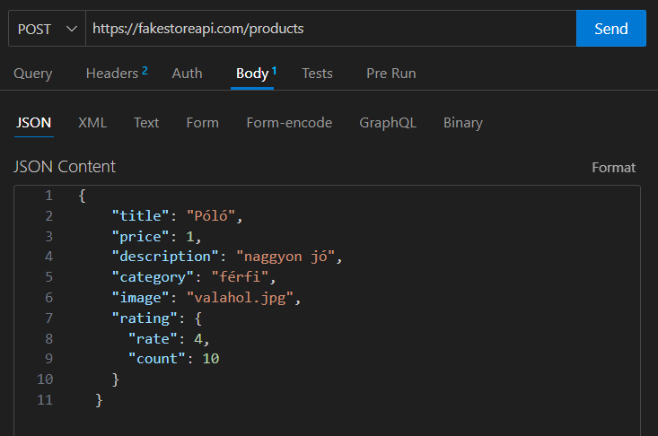
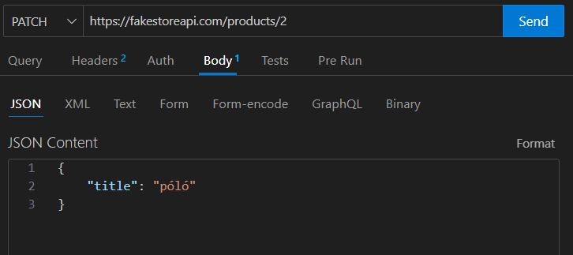
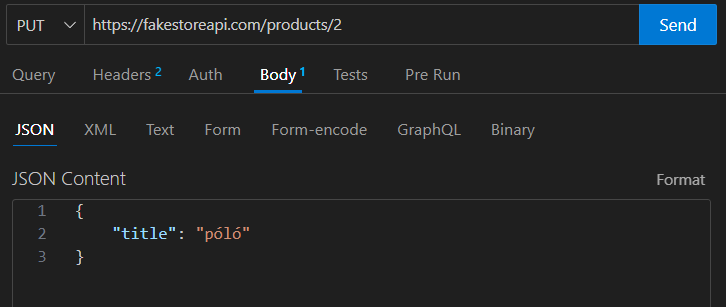

```
 _____     ______     ____    _______                  _____     _
|  __ \   |  ____|   / ___|  |__   __|        /\      |  __ \   | |
| |__) |  | |__     | |__       | |          /  \     | |__) |  | |
|  _  /   |  __|     \__ \      | |         / /\ \    |  ___/   | |
| | \ \   | |____    ___| |     | |        / ____ \   | |       | |
|_|  \_\  |______|  |____/      |_|       /_/    \_\  |_|       |_|
```

# API

**Application Programming Interface**

Alkalmazásunk felülete, amin keresztül tudunk vele kommunikálni

# REST 
**Representational State Transfer**

Attól függően, hogy milyen kéréssel (metódus) fordulunk a szerver felé, ez alapján fogja a válaszát elkészíteni. Egyfajta adatátvitel, ami a http protokoll architektúrájára épül (kliens-szerver)

# REST API
-Egy olyan API, amely a REST elveit követi. Egy REST API-n keresztül egy alkalmazás lehetővé teszi más alkalmazások vagy szolgáltatások számára, hogy kommunikáljanak vele HTTP kérések segítségével. Ezek a kérések lehetnek GET, POST, PUT, DELETE (**C**reate**R**ead**U**pdate**D**elete) stb. parancsok, amelyek lehetővé teszik az adatok lekérését, módosítását, hozzáadását vagy törlését az adott alkalmazásban vagy szolgáltatásban 

-Backend és frontend kód szétválasztása

-2 végpont kommunikációja

-A szerveroldalon endpoint(végpont) okat kell deklarálni pl: valami.hu/user, így a user-eket adja

-Az API-fejlesztők a kiszolgálóalkalmazás API dokumentációjában elmagyarázzák, hogyan kell az ügyfélnek használnia a REST API-t.


**REST API-hívás általános lépései:**


1.	A kliens kérést küld a szervernek. Az ügyfél követi az API dokumentációját, hogy a kérést a szerver számára érthető módon formázza.
2.	A szerver hitelesíti az ügyfelet, és megerősíti, hogy az ügyfélnek jogában áll a kérést benyújtani.
3.	A szerver megkapja a kérést, és belsőleg feldolgozza.
4.	A szerver választ küld a kliensnek. A válasz olyan információkat tartalmaz, amelyek közlik az ügyféllel, hogy a kérés sikeres volt-e. A válasz tartalmazza az ügyfél által kért információkat is.


## Mit tartalmaz egy REST API hívás
### URL
A szerver minden erőforrást egyedi erőforrás-azonosítókkal azonosít. 
A REST-szolgáltatások esetében a kiszolgáló általában egy egységes erőforrás-kereső (URL - Uniform Resource Locator) segítségével hajtja végre az erőforrás-azonosítást. 
Az URL az erőforrás elérési útját adja meg. Az URL hasonló azon webhelyek címéhez, amelyet a böngészőben adunk meg bármely weboldal meglátogatásához. 
Az URL-t kérés végpontnak is nevezik, és egyértelműen meghatározza a kiszolgáló számára, hogy az ügyfélnek mire van szüksége.

Például egy webshopból le szeretnénk kérni API-n keresztül az összes terméket, amihez a következő URL-t használjuk: http://webshop.com/termekek

### Metódus:
A HTTP metódus közli a szerverrel, hogy mit kell tennie az erőforrással. 
Nézzük meg a legáltalánosabb HTTP metódusokat:

**GET**
A kliensek a GET metódus segítségével érik el az erőforrásokat, amelyek a kiszolgáló megadott URL-címén találhatók. Gyorsítótárazhatják a GET kéréseket, és paramétereket küldhetnek a RESTful API kérésben, hogy utasítsák a szervert az adatok szűrésére a küldés előtt.

Előző példánknál maradva, amikor lekértük a termékeket, akkor azt egy GET metódussal tudtuk megtenni.

**POST**
A kliensek a POST metódus segítségével küldik el az adatokat a szervernek. Tartalmazza az adatot a kéréssel együtt.

*PUT*
Egy termék összes adatának cseréje

**PATCH**
Egy termék egy vagy több adatának cseréje. PUT helyett is ezt használják

**DELETE**
Egy termék törlése


### HTTP fejlécek
A kérések fejlécei a kliens és a szerver közötti metaadatok. Például a kérés fejléce jelzi a kérés és a válasz formátumát, információt ad a kérés állapotáról stb:

-Authorization: hitelesítési token felhasználó azonosításához

-Content-Type: a küldött adatok formátumának meghatározása (pl. application/json)


### Adat
A REST API kérések tartalmazhatnak adatokat a POST, PUT és más HTTP metódusok sikeres működéséhez.

A JSON (JavaScript Object Notation) egy általános formátum az adatok REST API-n keresztül történő küldéséhez és kéréséhez.

A JSON egy kulcs-érték párosokból felépülő objektum. Az előző webshopos példánál maradva egy termék a következőképpen nézhet ki JSON-ban:

```js
{
    "termekId": 1,
    "termekNev": "alma",
    "termekAr": 400, 
}
```

Ezt a JSON formázott szöveget pedig elhelyezhetjük az API kérés törzsében (*body*).


### Paraméterek
A RESTful API kérések tartalmazhatnak olyan paramétereket, amelyek további részleteket adnak a szervernek a teendőkről. Az alábbiakban néhány különböző típusú paraméter található:

Útvonal (path) paraméter amit az URL-ben helyezünk el. Tegyük fel nekem a webshopból szükségem lenne az 1-es azonosítóval ellátott termék részleteire, akkor a következő URL-t kellene megadnom: http://webshop.com/termekek/1

Lekérdezés (query) paraméter, ami hasonlít az útvonal paraméterhez, de segítségével több feltételt is megadhatunk, amivel szűkíthetjük a lekérdezést a szerverről. Például szeretném megkapni a férfi ruházatok közül az M-es méretű, fekete pólókat, akkor az a következőképpen nézne ki: http://webshop.com/termkek/ferfi-ruhazatok?kategoria=polo&meret=m&szin=fekete

Mint láthatjuk a ferfi-ruházatok rész után következő kérdőjel után sorolhatjuk fel a további paramétereket, & jellel elválasztva egymástól őket.

## Mit tartalmaz egy REST API szerver válasz
A REST alapelvek megkövetelik, hogy a szerver válasza a következő fő összetevőket tartalmazza:

### Állapotkód
Az állapotsor egy háromjegyű állapotkódot tartalmaz, amely a kérés sikerességét vagy sikertelenségét jelzi. Például a 2XX kód sikert jelez, de a 4XX és 5XX kód hibát jelez. A 3XX kódok az URL-átirányítást jelzik. Nézzük meg a főbb állapotkódokat:
 

**Állapotkódok és jelentésük**

200: Ez a szokásos kód a sikeres HTTP kérésekre.

201: Ez a szabványos válasz egy olyan HTTP-kérésre, amely egy elem sikeres létrehozását eredményezte.

204: Ez is egy válasz sikeres HTTP-kérésekre, ahol a válasz törzsében nem ad vissza semmit.

400: A kérést nem lehet feldolgozni rossz kérés szintaxis, túl nagy méret vagy más kliensoldali hiba miatt.

403: A kliensnek nincs engedélye ehhez az erőforráshoz.

404: Az erőforrás jelenleg nem található. Lehetséges, hogy törölték, vagy még nem is létezik.

500: Általános válasz egy váratlan meghibásodásra, ha nem áll rendelkezésre pontosabb információ.

A válasz törzs (body) tartalmazza az erőforrás-ábrázolást. A szerver a kérés fejlécek tartalma alapján választ ki egy megfelelő megjelenítési formátumot. Például a kliensek JSON formátumban kérhetnek információkat.


##Tesztelés:

**1**

https://fakestoreapi.com/









**2**
https://reqres.in/

**3**
https://fakerestapi.azurewebsites.net/index.html
 

