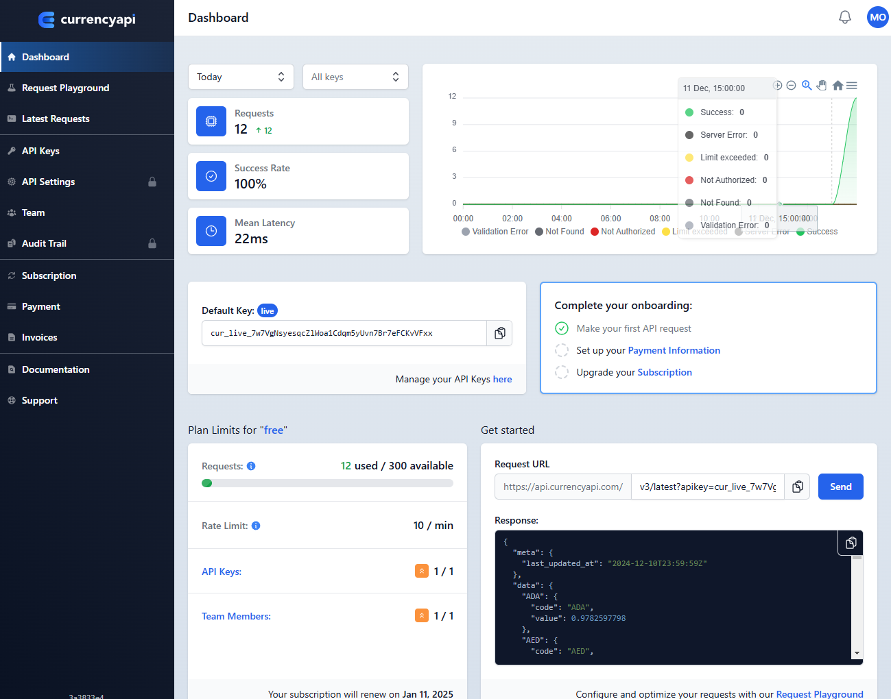
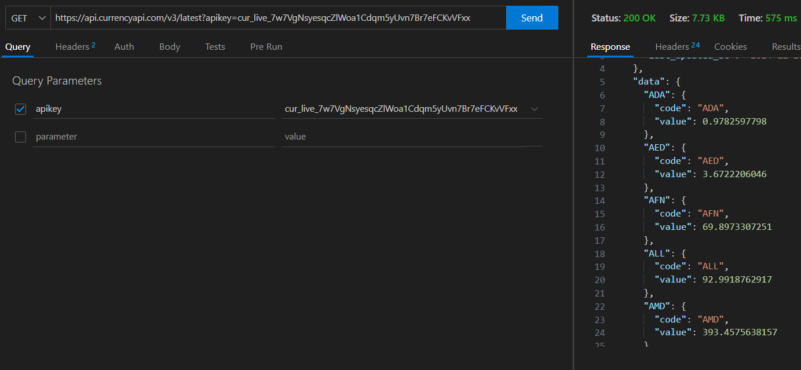
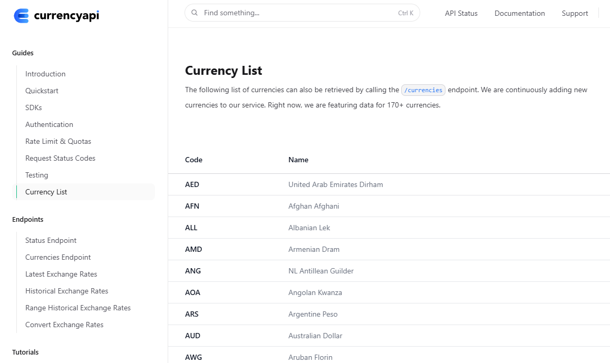
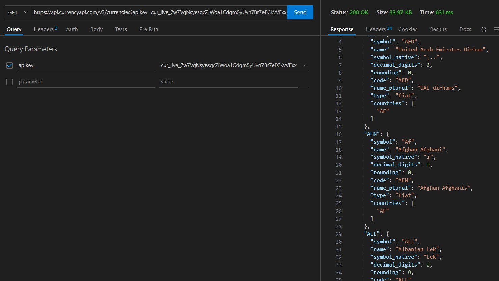
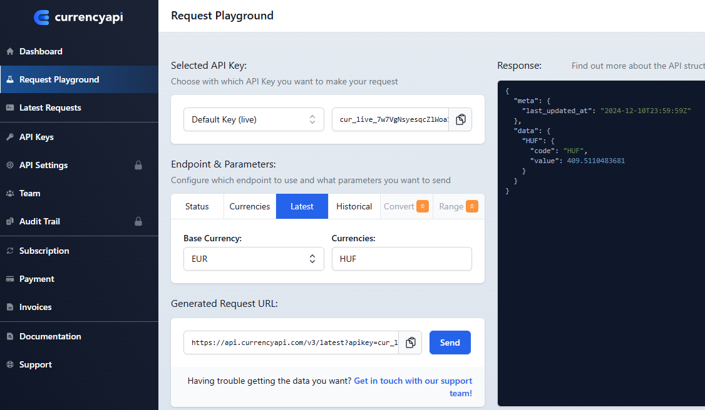
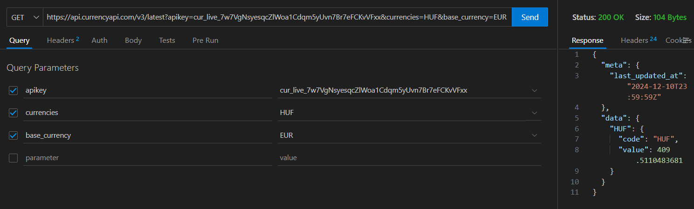

#Valutaváltás
**Kérj be egy Ft összeget, add meg az aktuális árfolyamon, hogy mennyi Euro-t ér.**

##Előkészületek:
1. Keressünk REST API-t hozzá:

pl: https://currencyapi.com/

3. próbáljuk ki a használatát:
   
-Get Free API Key

-regisztráljunk be

-email visszaigazolása után, megvan az apikey.

3. Listázzuk ki az alapértelemzett valuta (USD) váltási arányait:
   

https://api.currencyapi.com/v3/latest?apikey=cur_live_7w7VgNsyesqcZlWoa1Cdqm5yUvn7Br7eFCKvVFxx

4. Ezt próbáljuk meg Thunder Client-ben is:

5. Listázzuk ki a valuta nemeket:

https://api.currencyapi.com/v3/currencies?apikey=cur_live_7w7VgNsyesqcZlWoa1Cdqm5yUvn7Br7eFCKvVFxx

6. Próbáljuk ezt ki a Thunder Client-tel is:

7. Próbáljuk ki a felületen, hogy 1 EURO (base) hány forint:

https://api.currencyapi.com/v3/latest?apikey=cur_live_7w7VgNsyesqcZlWoa1Cdqm5yUvn7Br7eFCKvVFxx&currencies=HUF&base_currency=EUR

8. Próbáljuk ezt ki a Thunder Client-tel is:

